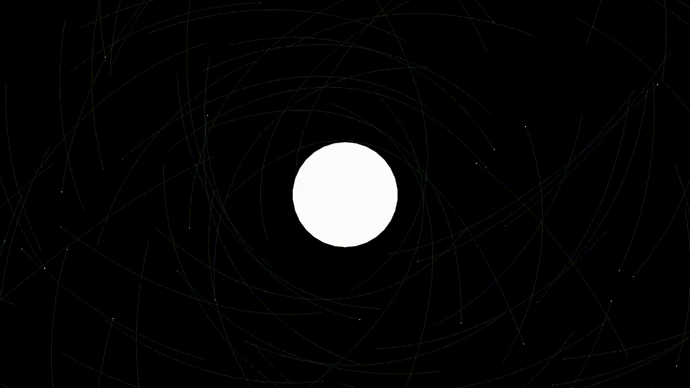

# Barnes_Hut_Algorithm

This project simulates gravity force interactions between many entities. To this end it
implements the [Barnes Hut Algorithm](https://en.wikipedia.org/wiki/Barnes%E2%80%93Hut_simulation) which uses quadtrees
to achieve `O(n log n)` time complexity. 
This project also allows the user to compare it with the brute force algorithm
that has a time complexity of `O(n^2)`. The goal of this project was practicing the C++ development
and data structures (as well as playing with some basic physics).
It also implements a few tools for visualising the inner workings of the algorithm.



## Controls

* General
    - `B` - toggle between the `Barnes Hut` and the brute force algorithm
* Camera movement
    - `W` - Move up
    - `A` - Move left
    - `S` - Move down
    - `D` - Move right
    - `P` - Zoom in
    - `L` - Zoom out
* Follow option
    - `E` - follow the next entity
    - `Q` - follow the previous entity
    - `Z` - Disable the follow mode
* Visuals
    - `T` - toggle the quad tree visual
    - `F` - toggle `the acceleration (red)`, `velocity (green)` vector visuals
    - `G` - toggle entity trackers
    - `C` - Clear the entity trackers
    - `I` - toggle the entity tracker point limit

## Requirements

- The [Universal](https://github.com/scorp18pl/Universal) library installed.

## Setup

First, clone the repository using

```console
$ git clone https://github.com/scorp18pl/Barnes_Hut_Algorithm
```

Then you will have to install sfml

```console
$ sudo apt-get install libsfml-dev
```

After that create a build folder (inside the root repo folder) and head to it

```console
$ mkdir build && cd build
$ cmake .. && make
```

The bha file inside the build directory is the binary
used to run the program.
